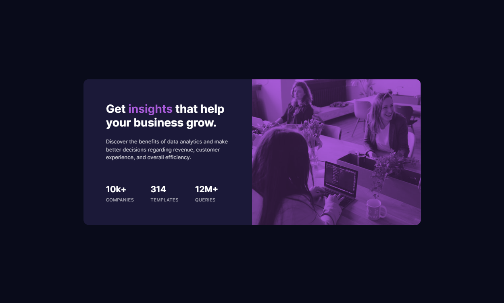

# Frontend Mentor - Stats preview card component solution

This is a solution to the [Stats preview card component challenge on Frontend Mentor](https://www.frontendmentor.io/challenges/stats-preview-card-component-8JqbgoU62). Frontend Mentor challenges help you improve your coding skills by building realistic projects. 

## Table of contents

- [Overview](#overview)
  - [The challenge](#the-challenge)
  - [Screenshot](#screenshot)
  - [Links](#links)
- [My process](#my-process)
  - [Built with](#built-with)
  - [What I learned](#what-i-learned)
- [Author](#author)

## Overview

### The challenge

Users should be able to:

- View the optimal layout depending on their device's screen size

### Screenshot




### Links

- Solution URL: [Solution](https://github.com/melissabo94/stats-preview-card)
- Live Site URL: [Live Site](https://melissabo94.github.io/stats-preview-card/)

## My process

### Built with

- Semantic HTML5 markup
- CSS custom properties
- Flexbox
- CSS Grid

### What I learned

```html
<div class="image">
  <div class="overlay"></div>
    <picture>
      <source media="(max-width: 768px)" srcset="./images/image-header-mobile.jpg">
      
    </picture>
</div> 

<div>
  <p class="num">10k+</p>
  <p class="heading">companies</p>
</div>
```
```css
.image {
    position: relative;
}

.overlay {
    position: absolute;
    top: 0;
    left: 0;
    width: 100%;
    height: 100%;
    background-color: hsl(277, 64%, 61%);
}

.image img {
    height: 100%;
    width: 100%;
    object-fit: cover;
    opacity: 75%;
    mix-blend-mode: multiply;
}
```

## Author

- LinkedIn - [Melissa Borgnino](https://www.linkedin.com/in/melissa-borgnino-909712198/)
- Frontend Mentor - [@melissabo94](https://www.frontendmentor.io/profile/melissabo94)